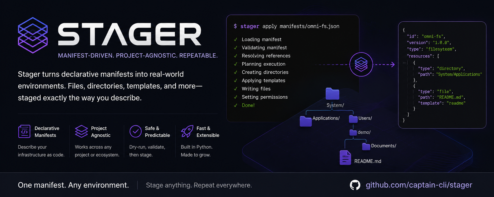

# Captain Stager

<p align="center">
    
</p>

Stop rebuilding the same environment. Describe it once. Stage it anywhere.

**Manifest-driven environment staging for the Captain ecosystem.**

Captain Stager prepares repeatable filesystem layouts from declarative manifests. Rather than writing setup scripts for every project, Stager consumes manifests and produces consistent environments that can be recreated anywhere.

---

## Features

- Declarative filesystem staging
- Variable substitution
- Safe filesystem operations
- Dry-run support
- Project-local manifest discovery
- Captain Core integration
- Manifest ownership validation

---

## Installation

```bash
pip install captain-stager
```

For development:

```bash
pip install -e ../captain-core
pip install -e .
```

---

## Quick Start

Validate a manifest.

```bash
stager validate filesystems/omni-shell-demo
```

Preview the operations.

```bash
stager apply filesystems/omni-shell-demo --dry-run
```

Apply the manifest.

```bash
stager apply filesystems/omni-shell-demo \
    --root /opt/omni-fs
```

---

## Manifest Resolution

Stager delegates manifest discovery to Captain Core.

Captain Core searches in the following order:

1. Explicit file path
2. Relative file path
3. Project-local Captain manifests

```
captain/
└── manifests/
    └── stager/
        └── filesystems/
```

Captain Core validates ownership before execution to ensure manifests cannot be consumed by the wrong tool.

---

## Architecture

```
Manifest Reference
        │
        ▼
Captain Core
────────────────────────
Locate project
Resolve manifest
Load JSON
Validate header
Validate ownership
        │
        ▼
ResolvedManifest
        │
        ▼
Captain Stager
────────────────────────
Parse resources
Expand variables
Validate resources
Build execution plan
Execute
```

---

## Responsibility Boundaries

### Captain Core

Captain Core provides shared infrastructure.

- Project discovery
- Manifest resolution
- JSON loading
- Header validation
- Ownership validation
- Filesystem safety
- Shared models
- Shared errors

### Captain Stager

Stager provides staging behavior.

- Filesystem parsing
- Variable expansion
- Resource validation
- Execution planning
- Filesystem execution
- Reporting

---

## Design Philosophy

Captain Core discovers and validates manifests.

Captain tools interpret and execute them.

If functionality is shared across multiple Captain tools, it belongs in Captain Core.

If functionality depends on staging semantics, it belongs in Captain Stager.

---

## Roadmap

Future resource types include:

- Templates
- Symbolic links
- Permissions
- Mount points
- Archive extraction
- Resource plugins

---

## Captain Ecosystem

```
Captain
│
├── Captain Core
├── Stager
├── Schemawright
└── Servicewright
```

Stager is the environment staging tool within the Captain ecosystem.

## Explicit source roots

Stager separates the **source filesystem** from the **target filesystem**. Copy sources are resolved inside an explicit source root, while destination paths are resolved inside the target root.

The source root is selected in this order:

1. `--source-root`
2. `STAGER_SOURCE_ROOT`
3. manifest `sourceRoot`
4. the manifest directory for backward compatibility

This lets a source-controlled Stager manifest operate on a Captain artifact without being copied into that artifact:

```bash
stager plan manifest/stager.linux.json \
  --target linux \
  --source-root .captain/artifacts/example

stager apply manifest/stager.linux.json \
  --target linux \
  --source-root .captain/artifacts/example
```

Copy `source` and destination `path` values must remain safe relative references. Attempts to escape their declared roots with values such as `../../...` are rejected during manifest processing/planning.
